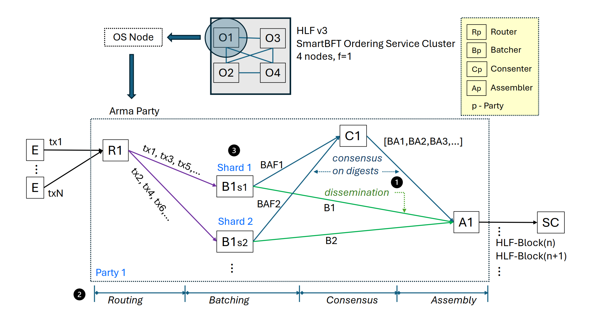
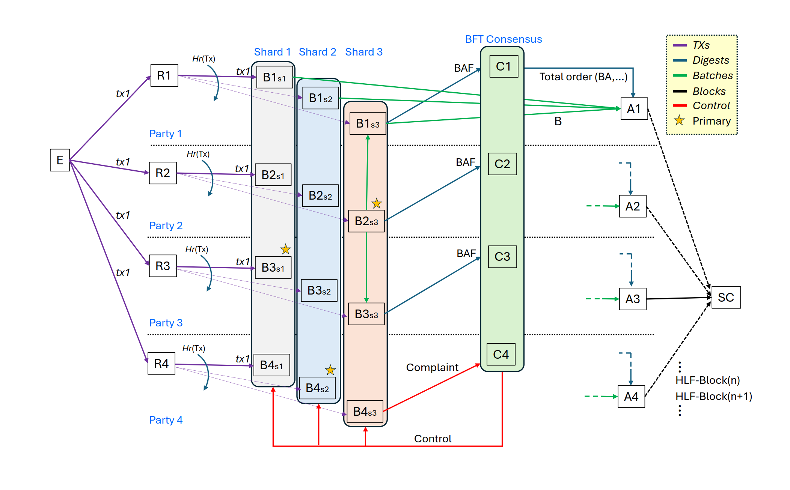

<!--
Copyright IBM Corp. All Rights Reserved.

SPDX-License-Identifier: Apache-2.0
-->
# Fabric-X Orderer Architecture

1. [Overview](#1-overview)
2. [Design Principles](#2-design-principles)
3. [System Components](#3-system-components)
4. [End-to-End Transaction Flow](#4-end-to-end-transaction-flow)
5. [Data Model](#5-data-model)
6. [Configuration and Membership](#6-configuration-and-membership)
7. [State, Persistence, and Recovery](#7-state-persistence-and-recovery)
8. [Scaling and Fault Tolerance](#8-scaling-and-fault-tolerance)
9. [Client APIs](#9-client-apis)
10. [Observability](#10-observability)
11. [Implementation Map](#11-implementation-map)

## 1. Overview

Fabric-X Orderer is a Byzantine Fault Tolerant ordering service based on the Arma protocol. 
The main objective of the Arma protocol is performance: its goal is to order a large volume of transactions per second while maintaining a reasonable transaction latency.
This is achieved by employing three design principles:

 - Separation of transaction dissemination from consensus
 - Parallelism through pipelining and sharding
 - Small transactions by stripping certificates from transactions and keeping predefined full signer identities in an in-memory cache

The system is composed of four node roles. **Routers** accept transaction submissions, verify them, and forward them to batchers. **Batchers** create, persist and replicate batches, and send batch attestation fragments (small messages with a batch digest) to consenters. **Consenters** order batch attestation fragments through SmartBFT, producing a totally ordered stream of batch attestations. Finally, **assemblers** collate the small totally ordered batch attestations with full batches pulled from the batchers, and create the final Fabric-compatible block ledger.

Arma separates transaction dissemination, batch replication, and payload persistence from consensus. Consensus orders batch attestations and other batch metadata instead of full transaction payloads, which keeps the critical BFT path fast and lets batching and storage scale by using additional hardware through the use of parallelism and sharding.

For simplicity, this document first explains the flow within a single Arma party. It then expands the same flow to the multi-party topology, where routers, batchers, consenters, and assemblers cooperate across parties for censorship resistance, BFT ordering, and block availability.

### Single-Party Processing Path

An Arma party is analogous to one HLF v3 Ordering Service (OS) node. In Fabric v3 an ordering node is a single process. In contrast, in Arma, it is not one process; it contains 4 role nodes: a router (R), one or more batchers (B), a consenter (C), and an assembler (A). 

Endorsing clients (E) submit transactions to the router using the Fabric broadcast API. The router is the party-local entry point: it receives client envelopes, applies the configured request checks, maps each valid transaction to a shard, and forwards the transaction to the batcher of its own party in that shard. This keeps the client-facing interface compatible with Fabric while allowing Arma to split work internally across shard-local batchers.

Batchers are responsible for creating batches of transactions, which later turn into blocks. They aggregate transactions into batches such as B1 and B2, persist them, and replicate them among the batchers in the shard. Batchers then compute batch attestation fragments over those batches, such as BAF1 and BAF2. A BAF is a short signed message (a batch digest and some metadata) attesting to a stored batch. The batch payloads remain in the batcher; they are not carried through the consensus bottleneck path. Only compact messages, including digests and some metadata that identify stored batches, are sent toward the consensus cluster. This separation lets large transaction envelopes use scalable storage and retrieval paths while consensus handles smaller ordering records.

The consensus cluster collects BAFs from all parties in the shard. Once enough BAFs have been received for a particular batch, a batch attestaion (BA) is emitted. The ordering cluster emits a total order of batch attestations (BAs), and also serves as the controller of the entire system, in particular of the inter shard behavior.

The assembler consumes the ordered BAs from consensus and the corresponding batches from the shards. For each ordered BA, the assembler fetches or receives the referenced batch payload, checks that the payload matches the ordered metadata, and assembles HLF blocks according to the order induced by consensus. Once assembled, the HLF blocks are available for the scalable committer (SC) to pull through the Fabric deliver API. In this single-party view, the important idea is that payload handling and ordering proceed separately and in parallel, and meet again only at assembly time.

### Multi-Party Transaction-to-Block Flow

The single-party view above shows how one Arma party separates payload handling from metadata ordering. In a full deployment, multiple Arma parties run the same roles and cooperate to arrive at the same ordered HLF blocks. The multi-party flow below shows how routers, batchers, consenters, and assemblers interact across parties.

In the multi-party topology, a correct endorsing client (E) tries to submit a TX to all parties instead of trusting one party. Each party has a router, shard-local batchers, a consenter, and an assembler. Submitting to all routers improves censorship resistance because no single router or party can silently suppress the transaction without other parties seeing it. Routers validate incoming Fabric `common.Envelope` messages, apply request rules, and dispatch each valid TX to a shard according to the shard mapper Hr, implemented as CRC64 over the request payload. Because every router uses the same shard mapper and shard configuration, each router consistently forwards the same request to the same shard.

After routing, the transaction enters the batcher layer for the selected shard. Each shard has one primary batcher for the current term and secondary batchers in other parties. The primary batcher in a shard, for example B2s3 in shard 3, bundles transactions into a batch, persists the batch locally, and serves it through the batcher `Deliver` path. Secondary batchers pull the primary batch through `Deliver`, verify it, persist local copies, send their own BAFs, and acknowledge the primary. This pull-and-ack flow keeps enough replicated payload state so assemblers can later retrieve ordered batches even if one party is unavailable.

Batchers that persist a batch send a batch attestation fragment (BAF) to the consensus cluster. A BAF is compact signed metadata attesting that the signer persisted a batch with a specific digest and batch metadata. This is the boundary between payload replication and BFT ordering: full transaction payloads stay in the batcher storage path, while BAFs, digests, and control events enter the consenter path. Consenters therefore order references to stored batches rather than carrying complete transaction envelopes through SmartBFT.

Upon receiving a threshold of BAFs for a batch, the consensus cluster emits a total order of batch attestations (BAs). Consenters exchange SmartBFT messages with one another and agree on the sequence of BAs and control events. The output of consensus is the same logical order for all parties. At this point, Arma knows the global order of batches, but an HLF block cannot yet be appended until an assembler has matched each ordered BA with the corresponding batch payload.

Assembler nodes collate two streams: the ordered BA stream from consensus and the matching batches fetched from the batcher shards. For each ordered BA, an assembler retrieves the referenced batch, verifies the relationship between ordered metadata and payload content, places the batch at the next ledger height, and appends an HLF block to its local ledger. Multiple assemblers can perform this materialization independently, giving block consumers more places to read from without changing the order agreed by consensus.

The scalable committer (SC) reads HLF blocks from assemblers through the Fabric `Deliver` API. The final block contains ordered transaction envelopes, but transaction validity is still decided downstream by the committer. The orderer guarantees total order, availability of ordered payloads, and Fabric-compatible block delivery. It may perform request admissibility and signature checks at router or batcher boundaries, but it does not perform the committer's endorsement validation, MVCC checks, namespace policy decisions, or commit decisions.

Finally, the multi-party flow includes a control path for primary batcher problems. If a batcher suspects primary misbehavior, for example B4s3 in shard 3, it may complain to the consensus cluster. Given enough distinct complaints, consensus can exert control and change the primary of a shard. This control path lets the system recover from faulty or slow shard primaries while preserving the same high-level split: transaction payloads move through routers and batchers, ordering metadata moves through consenters, and assemblers join both paths into HLF blocks.

## 2. Design Principles

The architecture focuses on keeping transaction payload work outside the consensus bottleneck path while preserving total order and BFT safety. Arma treats consensus as a scarce resource: consenters should spend their time ordering compact batch metadata and control events, while routers, batchers, and assemblers handle high-volume data movement and storage.

The goals below follow from that separation. Each goal preserves Fabric compatibility at the system boundary while allowing Fabric-X Orderer to scale the internal data plane independently from the BFT ordering plane.

Key principles:

1. **Parallelism through Pipelining:** Request processing is handled via a pipeline of server roles, where each stage executes a dedicated part of the total processing load.
2. **Parallelism through Sharding:** Add batcher shards to increase transaction intake, disk bandwidth, and batch creation capacity.
3. **Separate ordering from data dissemination:** Ordering is done on small messages, BAFs and BAs, whereas full transaction data in the form of blocks flows in a parallel path.
4. **BFT ordering:** Use SmartBFT among consenters to establish total order over batch attestations (BAs).
5. **Small transactions:** The transaction does not carry the certificate (identity) of endorsers and submitting client. Instead, it carries a short identifier which references to the full identity. The full identity is predefined and stored in memory. 
6. **Fabric compatibility:** Expose Fabric Atomic Broadcast `Broadcast` and `Deliver` APIs at the client edge.

Together these goals define the responsibility boundary of the orderer. The orderer makes transactions available in a deterministic block order; it does not decide final application validity. Downstream committers can therefore scale validation and commit logic without requiring consenters to process full transaction semantics.

## 3. System Components

Fabric-X Orderer is split into role-specific services so each part can be scaled, secured, and operated according to its workload. Routers and assemblers face clients and block consumers, respectively, while batchers and consenters are internal services that move payloads and ordering metadata between parties.

| Component | Purpose | Main package |
|-----------|---------|--------------|
| Router | Accepts client transactions, applies request rules, maps requests to shards, and forwards to batchers. | [`node/router`](https://github.com/hyperledger/fabric-x-orderer/blob/main/node/router) |
| Batcher | Collects requests, forms batches, persists batches, replicate batches, serves batches for assembler pull, and sends batch attestation fragments to consenters. | [`node/batcher`](https://github.com/hyperledger/fabric-x-orderer/blob/main/node/batcher) |
| Consenter | Runs SmartBFT consensus to order batch attestations and configuration decisions. | [`node/consensus`](https://github.com/hyperledger/fabric-x-orderer/blob/main/node/consensus) |
| Assembler | Reads ordered attestations, pulls batches from batchers, and writes Fabric-compatible blocks. | [`node/assembler`](https://github.com/hyperledger/fabric-x-orderer/blob/main/node/assembler) |

Routers and assemblers form the public client boundary. Batchers and consenters are internal ordering-service roles. 

Each role is intentionally narrow. Routers decide where a request should go, batchers make payloads durable and attestable, consenters decide total order, and assemblers materialize ordered metadata into blocks. 

## 4. End-to-End Transaction Flow

This section summarizes the normal data path described above. Control, configuration, failure handling, and reconfiguration paths are covered in the role-specific documents. The normal path starts at Fabric `Broadcast`, crosses the internal Arma pipeline, and ends at Fabric `Deliver`.

1. Client opens a `Broadcast` stream to one or more routers. A correct client is expected to submit to try and submit to all routers, however it can stop trying after succesfully submiting to 2F+1 routers.
2. Router receives `common.Envelope` messages, applies request rules, and maps each request to a shard.
3. Router forwards the request to the batcher that belong to its party within that shard.
4. Primary batcher inspects requests, inserts them into the request pool, cuts batches, persists batch payloads, and serves batches through `Deliver` for secondary pull.
5. Secondary batchers pull primary batches through `Deliver`, verify them, persist local copies, send BAFs, and acknowledge the primary.
6. Batchers emit batch attestation fragments (BAFs) and control events to consenters.
7. Consenters run SmartBFT and produce a total order of batch attestations (BAs).
8. Assembler consumes ordered batch attestations from consenters and fetches referenced batches from batchers.
9. Assembler collates batch attestations and full batches into ordered HLF blocks and appends them to its local ledger.
10. Client or committer opens a `Deliver` stream to an assembler and reads committed orderer blocks.

The list is linear, but implementation is pipelined. Routers can keep accepting requests while batchers cut earlier requests, consenters order previous attestations, and assemblers prefetch already-ordered batches. This pipelining is important for throughput because no single stage must wait for an entire transaction lifecycle before processing the next item.

This flow means consensus never needs to carry full transaction payloads in the common case. It orders metadata that points assemblers to batch payloads already stored by batchers. If a batch is ordered before a local assembler has the payload, the assembler waits for or fetches the matching batch rather than changing the decided order.

## 5. Data Model

Core data items move through the pipeline. Each item exists at a different layer of abstraction: requests are client inputs, batches are payload containers, BAFs and batch attestations are ordering metadata, and blocks are the Fabric-compatible output read by committers.

- **Request:** Client-submitted Fabric `common.Envelope` plus routing and validation metadata.
- **Batch:** Ordered group of requests created by a batcher shard and persisted in batcher storage.
- **BAF:** Batch Attestation Fragment. Signed metadata attesting to a stored batch digest and related batch metadata, sent from batchers to consenters.
- **Batch Attestation:** Consensus-ordered metadata identifying a batch digest, shard, sequence, primary, and attesting signers in global order.
- **Block:** Fabric-compatible block assembled from ordered batch metadata and fetched transaction payloads.

The digest relationship between these data items is central to correctness. Consenters order compact references, and assemblers later check that fetched payloads match those references before writing blocks. This lets the system avoid moving payloads through consensus without losing linkage between ordered metadata and actual transaction bytes.

The orderer does not decide final transaction validity. Invalid-by-application transactions can still appear in ordered blocks and are later handled by the committer. This is the same broad separation used by Fabric ordering services: ordering decides sequence and availability, while validation and commit decide ledger effects.

## 6. Configuration and Membership

Each node is configured by two pieces of information: the shared configuration, which is encoded in a configuration block; and a local configuration which is stored in a local YAML file.

Every node loads `config.NodeLocalConfig` from YAML. Local configuration a process which party it belongs to, where it listens, where it stores state, and which identity it uses. 
The same binary can run different roles depending on which role is specified in the command starting the process. The server running a specific role then expects some role specific sections in the local config.

Common sections include:

- `General`: listen address, TLS, keepalive/backoff, bootstrap, MSP identity, and logging.
- `FileStore`: local path for ledgers, databases, WALs, and role state.
- Role-specific section: exactly one of `Router`, `Batcher`, `Consensus`, or `Assembler`.

Network-wide membership comes from the shared configuration, which is encoded in a config block. To boostrap a network, all nodes must be given the same genesis block. The path to the genesis block is referenced by `General.Bootstrap` key. 
All nodes in a deployment must use the same genesis block configuration.

Like in Fabric, the configuration block is part of the ledger, and can be changed only through a configuration transaction.

Configuration generation is typically handled by [`armageddon`](https://github.com/hyperledger/fabric-x-orderer/blob/main/cmd/armageddon/README.md). Generated files reduce accidental mismatch between parties, but operators still need to distribute identical genesis/configuration inputs and correct local identities to every node.

## 7. State, Persistence, and Recovery

Persistence is role-specific, but every role uses local state to restart without forgetting already processed configuration or ordering progress. Durable state is what lets a node recover without replaying the entire deployment from genesis or asking another role to reconstruct private local progress.

- Routers store configuration state and the last replicated consensus decition in a WAL (Write Ahead Log) under the local file store.
- Batchers persist batches in an array of ledgers, configuration state, and the last replicated consensus decision in a WAL.
- Consenters persist SmartBFT messages in a WAL and decision blocks (including configuration) in a ledger.
- Assemblers persist the final block ledger and recover from metadata stored in each block.

On restart, a node reloads local config, reads bootstrap/shared configuration, reopens local stores, and resumes from persisted state. Recovery depends on the role: routers resume decision tracking, batchers reopen batch storage, consenters rebuild consensus state, and assemblers scan/reopen the output ledger.

The important recovery invariant is monotonic progress. Nodes should not forget ordered decisions, already-persisted batches, or block heights they have exposed to consumers. Role-specific WALs, ledgers, and stores protect that invariant while allowing the system to continue after process restarts or host failures.

## 8. Scaling and Fault Tolerance

Arma scales by separating work across roles and shards. The highest-volume data path is handled by routers, batchers, and assemblers, while the BFT path remains focused on compact metadata and control events.
The resource demands of the different server roles are not the same:

- Provision routers with strong compute and networking capabilities. Storage requirements are very small.
- Provision batchers and assemblers with a fast, high-end, large storage system. High IOPS and bandwith is required, as well as the ability to hold all the blocks for a long period of time. The batchers and assemblers also need a strong network.
- Provision batcher shards to scale transaction intake and batch storage. The number of shards cannot be changed or reconfigured in the current version.
- Consensus nodes need less resources, as they process and store a much smaller volume of messages.

Fault tolerance comes from deploying several parties. Each party is assumed to be an administrative unit (an organization) in which the subcomponents trust each other. 
In the Arma protocol, a party is the basic unit of failure: if any element of the party has failed, we consider the entire party as faulty.
Different parties may belong to different organizations that do not trust each other.

The Arma protocol can tolerate **F=Floor(N/3)** failures, where **N** is the number of parties. That is, in order to tolerate **F** failures, one must deploy **N >= 3F+1** parties.
Arma provides tolerance against Byzantine failures, i.e., arbitrary deviations from the protocol, which includes crashes as well as malicious behavior.

Thus, the minimal deployment which supports fault tolerance has 4 parties. The recommended minimal production deployment has 7 parties, as this allows to bring one party down for maintenance while tolerating one extra unplanned failure.

Production deployments should enable TLS/mTLS and use identical genesis/configuration inputs across all parties. Correct configuration and certificate material are part of fault tolerance: a node with wrong membership or trust roots may be alive but unable to participate safely in routing, attestation, consensus, or delivery.

## 9. Client APIs

Routers implement Fabric Atomic Broadcast `Broadcast`. Assemblers implement Fabric Atomic Broadcast `Deliver`. These APIs preserve the client-facing shape expected by Fabric applications and committers while hiding Arma's internal sharding and BFT metadata flow.

Batchers and consenters expose internal gRPC services used by other orderer roles. These internal services carry routed requests, batch data, control events, consensus messages, and decision streams. They are not intended as general client submission or block-consumption APIs.

Operationally, clients should submit transactions to routers and read ordered blocks from assemblers. Internal services should be protected by node-to-node TLS/mTLS and treated as part of the ordering-service control plane and data plane, not as application-facing endpoints.

## 10. Observability

Each role defines metrics in its package-level `metrics.go` file. Monitoring bind settings are controlled by `Operations.ListenAddress` and `Operations.ListenPort`. Periodic metrics logging is controlled by `Metrics.MetricsLogInterval`.

Useful bottleneck signals include router submission/stream behavior, batcher request-pool pressure, consenter BAF/decision throughput, and assembler fetch/cache/collation progress. These signals should be read together because backpressure often appears downstream first and then propagates upstream.

For example, slow assembler fetches may indicate missing or slow batcher data, while low consenter decision throughput may indicate BAF threshold delays or consensus pressure. Router rejection rates, batcher mempool size, and assembler collation lag together give a clearer picture than any single metric alone.

## 11. Implementation Map

The role-specific documents contain deeper operational and implementation details. Start with this architecture document for the overall flow, then use the links below to inspect startup behavior, APIs, metrics, and failure handling for each service.

- Router details: [`node/router`](https://github.com/hyperledger/fabric-x-orderer/blob/main/node/router)
- Batcher details: [`node/batcher`](https://github.com/hyperledger/fabric-x-orderer/blob/main/node/batcher)
- Consenter details: [`node/consensus`](https://github.com/hyperledger/fabric-x-orderer/blob/main/node/consensus)
- Assembler details: [`node/assembler`](https://github.com/hyperledger/fabric-x-orderer/blob/main/node/assembler)
- Deployment guide: [../deployment/README.md](https://github.com/hyperledger/fabric-x-orderer/blob/main/deployment/README.md)
- Configuration generator: [../cmd/armageddon/README.md](https://github.com/hyperledger/fabric-x-orderer/blob/main/cmd/armageddon/README.md)

For code navigation, map role names directly to top-level packages under `node/`. Configuration generation and deployment files are useful when checking how role-level concepts become concrete endpoints, certificates, local paths, and bootstrap material.
